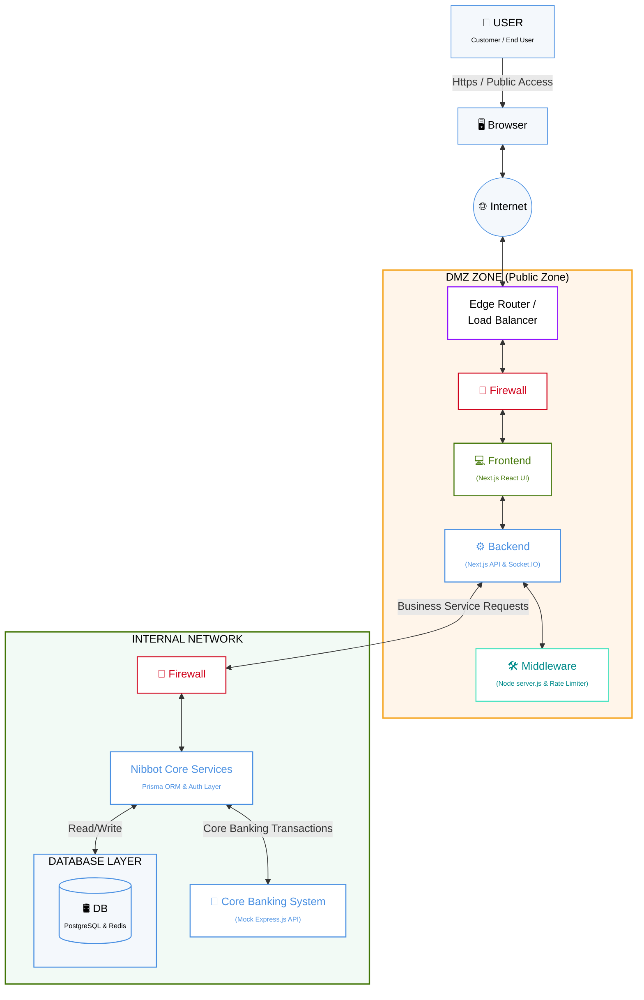

# Nibbot Application Architecture

This Mermaid diagram is generated based on the design template provided in `SAD_Architecture_Sample.png`, adapted to fit the specific components and technologies of the `nibbotfinal` application.

