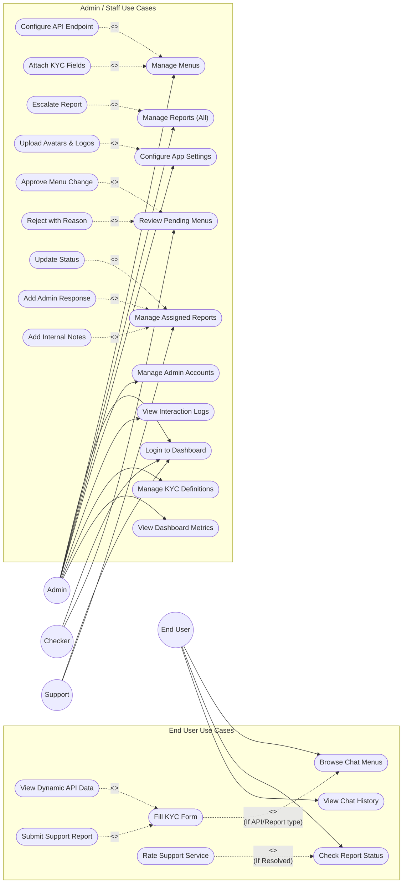
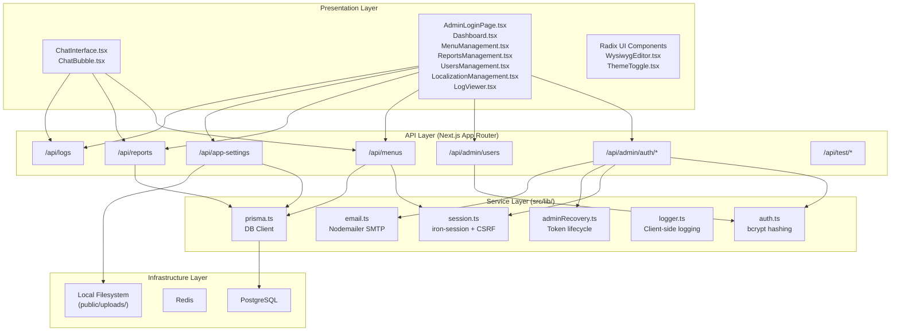

# Low-Level Design (LLD) Document

**Project Name:** Nibbot — Conversational Bot Platform  
**Document Version:** 1.0  
**Derived From:** Codebase Reverse-Engineering  

---

## 1. Introduction

### 1.1 Purpose of the LLD Document

This Low-Level Design (LLD) document provides a comprehensive technical specification that defines how each component of the Nibbot system is implemented. It translates the High-Level Design into detailed instructions for developers and engineers and serves as the definitive implementation reference.

#### 1.1.1 In-Scope Features

The following features are explicitly implemented in the codebase and are covered by this document:

- Admin authentication with role-based access control (Admin, Checker, Support)
- Dynamic hierarchical menu creation and management with maker-checker approval
- KYC (Know Your Customer) data collection via conversational chat forms
- Dynamic API endpoint configuration and response mapping per menu item
- User report submission with configurable sequential ID generation
- Report lifecycle management (pending → reviewed → resolved) with activity logging
- Real-time online user presence tracking via WebSocket and Redis
- Interaction logging with sensitive data masking
- Multi-language localization support (English and Amharic)
- Application-level settings management (avatars, branding, report ID format)
- Password recovery via database-persisted tokens and SMTP email delivery
- Click analytics tracking per menu item

#### 1.1.2 Out-of-Scope

The following features are **not explicitly identified in implementation**:

- Free-text AI/NLP intent recognition (system uses deterministic menu routing)
- External OAuth/SSO authentication providers
- Native mobile applications (iOS/Android)
- Third-party CRM or ERP integrations
- Automated CI/CD pipeline definitions
- Infrastructure as Code (Terraform, CloudFormation)

#### 1.1.3 Assumptions and Constraints

**Assumptions:**
- A PostgreSQL database instance is available and accessible via `DATABASE_URL`.
- The deployment environment supports long-lived WebSocket connections.
- Target users have access to modern web browsers supporting React 19.

**Constraints:**
- Socket.io state is in-memory per instance; horizontal scaling requires a Redis adapter (not yet configured).
- Avatar and logo images are persisted to local filesystem (`public/uploads/`), not to object storage.
- The `app_settings` table enforces a singleton row pattern (id=1).
- API configuration is stored as untyped JSON in PostgreSQL, validated at the application layer only.

#### 1.1.4 Audience for the Document

This document is intended for:
- Software Developers and Engineers implementing or maintaining the system
- Quality Assurance Engineers designing test cases
- System Architects reviewing implementation compliance
- DevOps Engineers managing deployment and infrastructure

### 1.2 Significance of the Project

Nibbot is designed to automate customer service interactions for banking and financial institutions. By replacing manual phone/email support with a structured, configurable conversational interface, the system reduces operational overhead, ensures consistent data collection via KYC forms, and provides a complete audit trail for support tickets. The maker-checker workflow ensures governance compliance for configuration changes.

### 1.3 System Design and Analysis

#### 1.3.1 Development Environment

| Component | Specification |
|:---|:---|
| **Operating System** | Cross-platform (Windows, macOS, Linux) |
| **Runtime** | Node.js ≥18 |
| **Language** | TypeScript 5.x, JavaScript (ES2022+) |
| **Package Manager** | npm (package-lock.json present) |
| **Dev Server** | `npm run dev` (Next.js Turbopack, port 9003) or `npm run dev:io` (Custom server + Socket.io, port 9002) |
| **Database** | PostgreSQL (local or remote via `DATABASE_URL`) |
| **Cache** | Redis (optional, via `REDIS_URL`) |

#### 1.3.2 Development Tools

| Tool | Version | Purpose |
|:---|:---|:---|
| Next.js | 16.2.1-canary | Framework (SSR, App Router, API routes) |
| Prisma | 7.5.0 | ORM and database migration tool |
| TypeScript | 5.x | Static type checking |
| ESLint | 9.x | Code linting and quality enforcement |
| TipTap | 2.11.5 | WYSIWYG rich-text editor |
| Tailwind CSS | 3.4.1 | Utility-first CSS framework |
| Radix UI | Various | Accessible headless UI components |
| Recharts | 2.15.1 | Data visualization in Dashboard |
| Zod | 3.24.2 | Runtime schema validation |

#### 1.3.3 Testing Procedures

This section is the formal testing governance policy. It defines the mandatory verification stages the system must pass before a change is accepted and before a release is approved.

Testing is executed in staged gates. Each gate produces traceable evidence (test run outputs, screenshots, exported Postman runs, or signed acceptance artifacts) and has explicit pass/fail criteria.

**Gate A — Developer Local Verification (per feature change)**
- Scope: fast validation during implementation.
- Required checks:
  - Unit-level negative/positive path validation for the changed logic (input validation, auth/role guards, CSRF enforcement, error handling).
  - Manual functional smoke on the impacted UI path (Admin, Checker, Support, and/or End User as applicable).
- Pass criteria: no runtime errors in the impacted path; expected success and failure responses observed; no new console errors.

**Gate B — Automated Suite Execution (pre-merge / pre-release)**
- Scope: regression coverage for core logic and UI rendering.
- Required checks:
  - Unit suite execution (Jest unit project).
  - Component suite execution (Jest components project).
  - API mock suite execution (Jest API project for mock services).
  - End-to-end execution for critical flows (Playwright).
- Pass criteria: all automated suites pass (no failing tests). Any skipped tests must be justified and recorded.

**Gate C — Integration Validation (API mapping and external behaviours)**
- Scope: validate end-to-end request/response mapping behaviour.
- Required checks:
  - Validate configured API menus against integration fixtures (mock endpoints and banking mock services) using Postman and by invoking the menu through the chat UI.
  - Validate boundary inputs: missing required fields, invalid types, unsupported values, and authorization failures.
- Pass criteria: mapping output matches configured templates/tables; failures are handled with user-safe messages; no unhandled exceptions.

**Gate D — Operational Readiness (release candidate)**
- Scope: confirm deployment survivability and operational correctness.
- Required checks:
  - Production build and server startup validation.
  - Database schema compatibility checks and post-change Prisma regeneration as required.
  - Basic operational smoke: menus load, reports submit, admin dashboard loads, and log streams remain stable.
- Pass criteria: application starts cleanly; no repeated server crashes; critical flows execute end-to-end.

**Gate E — Acceptance Testing (UAT)**
- Scope: business sign-off for release.
- Required checks:
  - UAT team executes functional scripts for: admin login, user creation, menu creation, report submission, report status lookup, and maker-checker governance flows.
- Pass criteria: signed acceptance artifact is produced; Critical/High defects are resolved or formally deferred with approval.

**Gate F — Operational Security Verification (release candidate)**
- Scope: confirm security controls remain effective after deployment configuration.
- Required checks:
  - Admin routes are protected (unauthorized access blocked; role-based access enforced).
  - CSRF enforcement for state-changing routes is effective.
  - Security headers remain present and correct (frame protection, content type protection, permissions policy).
  - CORS policy only permits approved origins when credentials are used.
- Pass criteria: security checks pass with representative requests; no broad origin reflection; no privilege escalation paths observed.

**Gate G — Security Testing (release candidate)**
- Scope: validate security survivability under controlled adversarial and misconfiguration scenarios.
- Required checks:
  - Authentication and session abuse checks (invalid sessions, expired sessions, session fixation attempts, logout invalidation).
  - Authorization checks (role separation; forbidden access to admin-only operations; support user cannot access unassigned reports).
  - Input and injection resilience checks (malicious HTML/JS payload attempts in chat content; unsafe URL injection attempts in rich text).
  - API misuse checks (replay/omitted CSRF token on state-changing routes; malformed JSON bodies; oversized payload rejection where enforced).
  - Configuration hardening checks (production cookie flags; origin allowlist configured; no permissive wildcard allowances in critical headers).
- Pass criteria: all checks are blocked or safely handled with no privilege escalation, no XSS execution, and no sensitive data exposure in responses or logs.

### 1.4 Acronyms and Definitions

| Acronym/Term | Definition |
|:---|:---|
| **KYC** | Know Your Customer — data collection fields for user identity verification |
| **CSP** | Content Security Policy — HTTP header controlling resource loading |
| **CSRF** | Cross-Site Request Forgery — attack vector mitigated via token validation |
| **RBAC** | Role-Based Access Control — permission model (Admin, Checker, Support) |
| **SSR** | Server-Side Rendering — HTML generated on the server per request |
| **ORM** | Object-Relational Mapping — database abstraction layer (Prisma) |
| **HSTS** | HTTP Strict Transport Security — forces HTTPS connections |
| **TTL** | Time To Live — expiration mechanism for tokens and cache entries |
| **Maker-Checker** | Dual-control workflow where one user creates and another approves |

## 2. System Functionality Overview

The Nibbot system provides two primary interfaces:

1. **End-User Chat Interface** — A conversational bot that presents hierarchical menus, collects KYC data through dynamic forms, executes configured API calls, and submits support reports.

2. **Admin Dashboard** — A comprehensive management portal for configuring menus, managing reports, administering users, viewing interaction logs, and customizing system settings.

The system operates on three response types per menu item:
- **Static** — Renders pre-configured HTML/text content directly in the chat
- **API** — Collects KYC inputs, constructs an API request using template variables, and renders the JSON response as a formatted table
- **Report** — Collects KYC inputs and creates a support ticket with a sequential ID

---

## 3. Detailed Design

### 3.1 Use Case Diagram

### 3.2 Description of the Components

#### 3.2.1 Login Component

| Attribute | Detail |
|:---|:---|
| **Source File** | `src/components/admin/AdminLoginPage.tsx`, `src/app/api/admin/auth/login/route.ts` |
| **Input Fields** | Username (text), Password (password) |
| **Processing** | Same-origin validation → credential lookup (Prisma) → bcrypt comparison → iron-session creation → CSRF token generation |
| **Output** | JSON `{success, username, role, csrfToken}` or 401 error |
| **Special Logic** | On first-ever login, if no admin exists, an initial admin is auto-seeded from environment variables (`ADMIN_INITIAL_USERNAME`, `ADMIN_INITIAL_PASSWORD`). On localhost, defaults to `admin` / `Admin@1234`. |

#### 3.2.2 Register Admin User

| Attribute | Detail |
|:---|:---|
| **Source File** | `src/components/admin/UsersManagement.tsx`, `src/app/api/admin/users/route.ts` |
| **Input Fields** | Username, Email, Password, Role (admin/checker/support), Group Name |
| **Validations** | Email regex, password strength (8+ chars, upper, lower, digit, special), unique username/email |
| **Authorization** | Only users with `admin` role can create new users |
| **Error Handling** | Prisma `P2002` error → "Username or email already exists" (409) |

#### 3.2.3 Menu Management Component

| Attribute | Detail |
|:---|:---|
| **Source File** | `src/components/admin/MenuManagement.tsx`, `src/app/api/menus/route.ts`, `src/app/api/menus/[id]/route.ts` |
| **Operations** | Create (POST), Update (PUT), Delete (DELETE), Approve/Reject (POST with action) |
| **Key Fields** | Name, NameAm, ResponseType, Content, ContentAm, ApiConfig, ParentId, Order, IsActive, SupportAssignee, AttachedMenuIds, KYCFields, TrackClicks, Translations |
| **Maker-Checker Logic** | New menus created with `approvalStatus: 'pending'`. Updates to approved menus are stored in `pendingUpdate` JSON field. Checker role approves/rejects. Self-approval is blocked. |
| **API Config Normalization** | `rootKey` defaults to `'data'`. `tableMappingMode` supports `array_path` and `exact_path`. Endpoint templates validated against mapped KYC field names. |

#### 3.2.4 Report Management Component

| Attribute | Detail |
|:---|:---|
| **Source File** | `src/components/admin/ReportsManagement.tsx`, `src/app/api/reports/route.ts`, `src/app/api/reports/[id]/route.ts` |
| **Create** | Public submission via POST. Generates sequential ID from `ReportIdConfig` (prefix + year + padded sequence). Auto-assigns `supportAssignee` from menu config. Creates `ReportActivity` entries for creation and assignment. |
| **Update (PATCH)** | Admin can change status, priority, supportAssignee, adminResponse, internalNotes. Support can only update reports assigned to them; cannot change priority. Escalation requires `supportAssignmentType` and `supportAssignmentReason`. |
| **Delete** | Admin-only. Requires CSRF token. |
| **Activity Logging** | Activities of type: `creation`, `assignment`, `response`, `resolution`, `escalation` are created automatically on state changes. |

#### 3.2.5 Application Settings Component

| Attribute | Detail |
|:---|:---|
| **Source File** | `src/app/api/app-settings/route.ts` |
| **Managed Settings** | Supported languages (JSON array), system translations (JSON object), bot/user avatar configuration (type + text/image), app logo, report ID configuration, show/hide admin panel icon |
| **Image Handling** | Base64 data URLs are decoded, validated (PNG/JPG/WebP/GIF/SVG), size-checked (≤600KB), and persisted to `public/uploads/avatars/` or `public/uploads/branding/` with random filenames. HTTP URLs and existing `/uploads/` paths are passed through. |

### 3.3 Class Diagram

```mermaid
classDiagram
    %% Enumerations
    class ResponseType {
        <<enumeration>>
        static
        api
        report
    }
    class MenuApprovalStatus {
        <<enumeration>>
        pending
        approved
        rejected
    }
    class KYCFieldType {
        <<enumeration>>
        text
        number
        tel
        email
        password
        boolean
    }
    class ReportStatus {
        <<enumeration>>
        pending
        reviewed
        resolved
    }
    class ReportPriority {
        <<enumeration>>
        low
        medium
        high
        urgent
    }
    class LogStatus {
        <<enumeration>>
        success
        failed
        error
    }
    class AdminRole {
        <<enumeration>>
        admin
        checker
        support
    }

    %% Classes
    class MenuItem {
        -String id
        -String parentId
        -String name
        -String nameAm
        -ResponseType responseType
        -String content
        -Json apiConfig
        -String supportAssignee
        -Int order
        -Boolean isActive
        -MenuApprovalStatus approvalStatus
        -Boolean trackClicks
        -Int clickCount
        -Int sessionClickCount
        -Json pendingUpdate
        -DateTime createdAt
        -DateTime updatedAt
        +create(data: Object) MenuItem
        +update(id: String, data: Object) MenuItem
        +delete(id: String) Boolean
        +get(id: String) MenuItem
        +getAll() MenuItem[]
        +approve(id: String) Boolean
        +reject(id: String, reason: String) Boolean
    }

    class MenuAttachment {
        -Int id
        -String menuId
        -String attachedMenuId
        -DateTime createdAt
    }

    class KYCField {
        -String id
        -String name
        -String prompt
        -String promptAm
        -KYCFieldType type
        -String validation
        -Int order
        -Boolean required
        -DateTime createdAt
        -DateTime updatedAt
        +upsert(data: Object) KYCField
        +delete(id: String) Boolean
    }

    class MenuKYC {
        -Int id
        -String menuId
        -String kycId
        -Int order
    }

    class UserReport {
        -String id
        -String userId
        -String menuId
        -String menuName
        -Json data
        -ReportStatus status
        -ReportPriority priority
        -String adminResponse
        -String internalNotes
        -String supportAssignee
        -Int serviceRating
        -DateTime timestamp
        -DateTime createdAt
        +submit(data: Object) UserReport
        +updateStatus(id: String, status: ReportStatus) UserReport
        +addAdminResponse(id: String, response: String) UserReport
        +assignToSupport(id: String, assignee: String) UserReport
    }

    class ReportActivity {
        -Int id
        -String reportId
        -String type
        -String actor
        -String target
        -String content
        -DateTime timestamp
        +logActivity(reportId: String, type: String, actor: String) ReportActivity
    }

    class AppSettings {
        -Int id
        -Json supportedLanguages
        -Json systemTranslations
        -String botAvatarType
        -String botAvatarImage
        -String appLogo
        -Boolean showAdminPanelIcon
        +getSettings() AppSettings
        +updateSettings(data: Object) AppSettings
    }

    class ReportIdConfig {
        -Int id
        -String prefix
        -Boolean yearEnabled
        -Int numberLength
        -Int startValue
        -Boolean resetEveryYear
    }

    class AdminCredential {
        -Int id
        -String username
        -String email
        -String passwordHash
        -AdminRole role
        -String groupName
        -DateTime createdAt
        +login(username: String, password: String) Object
        +register(data: Object) AdminCredential
        +changePassword(oldPass: String, newPass: String) Boolean
    }

    class AdminRecoveryToken {
        -String token
        -String username
        -DateTime expiresAt
        -Boolean consumed
        +generate(username: String) AdminRecoveryToken
        +verifyAndConsume(token: String) Boolean
    }

    class InteractionLog {
        -Int id
        -String sessionId
        -String userMessage
        -String botResponse
        -LogStatus status
        -Int responseTime
        -DateTime timestamp
        +logInteraction(data: Object) InteractionLog
        +getLogs() InteractionLog[]
    }

    class ClickHistory {
        -Int id
        -String menuId
        -String sessionId
        -DateTime clickedAt
        +recordClick(menuId: String, sessionId: String) ClickHistory
    }

    %% Relationships
    MenuItem "1" -- "0..*" MenuItem : association
    MenuItem *-- "0..*" MenuAttachment : composition
    MenuItem *-- "0..*" MenuKYC : composition
    KYCField "1" -- "0..*" MenuKYC : association
    MenuItem "1" -- "0..*" UserReport : association
    MenuItem *-- "0..*" ClickHistory : composition
    UserReport *-- "0..*" ReportActivity : composition
    AppSettings o-- "0..1" ReportIdConfig : aggregation
    AdminCredential "1" -- "0..*" AdminRecoveryToken : association
```

### 3.4 Component Diagram

---

## 4. Testing

This section documents the explicit engineering evidence for each testing stage, including the observed validation targets, boundary inputs, and executed functional scripts. Where automation exists, it is listed; where execution has been manual during development, it is recorded explicitly.

### 4.1 Unit Testing

Automated unit testing is explicitly identified in the implementation:
- Jest configuration is present (multi-project).
- Unit test files are present under the repository test suite and cover route-handler logic (auth and menu creation).

Observed unit test targets (automated evidence):
- Admin login route handler: missing credentials, invalid credentials, lockout threshold, successful login response contract (csrf token issuance).
- Menu creation route handler: CSRF rejection and successful create response contract (header issuance).

Boundary and validation parameters (unit evidence):
- Required field validation: empty username/password.
- Authentication negative path: invalid password.
- Security threshold: repeated failure count reaching lockout threshold (count >= 5).
- CSRF validation: missing/invalid CSRF token for state-changing admin routes.

=> Manual execution: Unit-level validation was performed during feature development as each capability was implemented, including positive and negative paths (input validation, auth failure modes, CSRF rejection, and success contracts).

Manual unit test cases executed (sample):

| Manual Test Case ID | Validation Target | Input / Steps | Expected Result (Observed) | Evidence |
|---|---|---|---|---|
| MU-UNIT-LOGIN-001 | Admin login input validation | Submit login with missing username/password. | Request rejected with a clear validation error and no session created. | Screenshot of UI error or captured API response body. |
| MU-UNIT-LOGIN-002 | Invalid credential handling | Submit login with valid username and invalid password. | Request rejected (unauthorized) and failure handling is applied. | Captured API response body and status code. |
| MU-UNIT-LOGIN-003 | Lockout threshold behaviour | Repeat invalid login attempts until threshold is reached. | Login attempts blocked with a rate/lockout response after threshold. | Timestamped notes + captured API response body. |
| MU-UNIT-MENU-001 | CSRF enforcement on state change | Call menu create/update without CSRF token (or with invalid token). | Request rejected (forbidden). | Captured API response body and status code. |

### 4.2 Integration Testing

Integration testing is explicitly identified through a combination of:
- Automated API validations against the mock exchange-rate service (Supertest-based tests).
- Manual Postman validations and full app integration via admin-configured API menus.

Observed integration targets (manual + automated evidence):
- Exchange-rate API (banking mock service):
  - Health check and rates retrieval.
- Case Data API (banking mock service):
  - Query and retrieval of case-related records using validated inputs.
- Transfer API (banking mock service):
  - Transfer submission with validation of required parameters and error handling.
- Application integration:
  - Admin-configured API menus targeting the above endpoints (endpoint, method, headers, and response mapping) and validated through the chat UI.

Boundary and validation parameters (integration evidence):
- Authorization enforcement: missing api-key returns unauthorized response.
- Input validation: negative amount rejected; missing required fields rejected.
- Unsupported values: unsupported currency codes rejected (not found).

=> Manual execution: Integration was validated continuously during development and again as a full-system validation by executing the banking APIs in Postman and by integrating them through the admin-configured API menus in the chat UI.

Manual integration test cases executed (sample):

| Manual Test Case ID | Integration Target | Validation Parameters / Steps | Expected Result (Observed) | Evidence |
|---|---|---|---|---|
| MI-EXRATE-POSTMAN-001 | Exchange API (Postman) | Execute health and rates endpoints with and without required authentication headers. | Valid requests return expected payload; invalid requests are rejected with safe error responses. | Postman response capture (status + body). |
| MI-EXRATE-MENU-001 | Exchange API (Admin-configured menu) | Configure an API menu targeting the exchange endpoint and validate output in the chat UI. | Chat renders the configured mapping (message/table) without runtime errors. | Screenshot of menu configuration + screenshot of chat result. |
| MI-CASEDATA-POSTMAN-001 | Case Data API (Postman) | Execute case data endpoint(s) using valid and invalid boundary inputs. | Valid requests return case dataset; invalid requests are rejected with clear error responses. | Postman response capture (status + body). |
| MI-CASEDATA-MENU-001 | Case Data API (Admin-configured menu) | Configure an API menu targeting the case data endpoint(s) and validate output in the chat UI. | Chat renders mapped case details correctly and handles errors gracefully. | Screenshot of menu configuration + screenshot of chat result. |
| MI-TRANSFER-POSTMAN-001 | Transfer API (Postman) | Execute transfer submission endpoint(s) with valid payloads and negative cases (missing fields/invalid values). | Valid submission returns success/receipt; invalid submissions are rejected with safe error messages. | Postman response capture (status + body). |
| MI-TRANSFER-MENU-001 | Transfer API (Admin-configured menu) | Configure an API menu targeting transfer endpoint(s) and validate output in the chat UI. | Transfer flow executes, results render as configured, and failures return expected fallback. | Screenshot of menu configuration + screenshot of chat result. |

### 4.3 System Testing

System testing is explicitly identified in the implementation:
- Browser-level end-to-end specifications exist and cover key journeys (admin login, menu creation smoke, chat landing, must-change-password lifecycle, and internal support flows).
- Some scenarios require a configured database connection; those scenarios are validated in environments where the database is available.

Observed system journeys (automated + manual evidence):
- Admin login and dashboard access.
- Menu creation entrypoint and basic admin navigation.
- Public chat landing rendering and baseline interaction.
- Forced password change lifecycle.
- End-to-end internal support flow (menu create, approve, report submit, status lookup) in DB-enabled environments.

=> Manual execution: System-level validation was performed during feature development and executed again as a complete end-to-end regression before release packaging. Automation exists for key paths and is expected to expand over time.

Manual system test cases executed (sample):

| Manual Test Case ID | User Journey | Steps | Expected Result (Observed) | Evidence |
|---|---|---|---|---|
| MS-LOGIN-001 | Admin login and dashboard access | Log in as Admin and confirm access to the admin console. | Admin console loads with correct role visibility. | Screenshot of successful landing page. |
| MS-USER-001 | User creation | Create a Checker or Support user; log in with the new user. | New user appears in list and can authenticate with assigned role. | Screenshot of created user + login confirmation. |
| MS-MENU-001 | Menu creation and approval | Create a menu; approve (maker-checker) if enabled; confirm visible in chat. | Menu is visible to end users when active/approved and responds correctly. | Screenshot of admin menu + screenshot of chat menu. |
| MS-REPORT-001 | Report submission and status lookup | Submit a report via chat; verify it appears in Reports; check status by reference. | Report reference generated; admin can view report; status lookup displays correct state and response. | Screenshot of report reference + screenshot of report in admin. |
| MS-RATING-001 | Service rating after resolution | Resolve a report; user checks status and submits rating and optional feedback. | Rating is saved and visible in admin reporting/ratings views. | Screenshot of rating UI + screenshot of admin rating view. |

### 4.4 Acceptance Testing

Acceptance testing is not yet formally recorded as a completed artifact in the repository:
- UAT execution is planned and will be performed by the UAT team against the in-scope features.
- Formal UAT sign-off and defect logs will be attached as release evidence when executed.

=> UAT status: Pending (to be executed by the UAT team).

Manual acceptance (UAT) test cases planned (sample):

| UAT Test Case ID | Scope | Script Summary | Expected Result | Status |
|---|---|---|---|---|
| UAT-LOGIN-001 | Admin | Log in and verify role-based access to admin modules. | Successful login; only authorized modules visible. | Planned |
| UAT-USER-001 | Admin | Create a Support user and verify login. | User created; login works; role enforced. | Planned |
| UAT-MENU-001 | Admin/Checker/End User | Create a menu, approve it, and validate in chat. | Menu appears to end users after approval; response matches configuration. | Planned |
| UAT-REPORT-001 | End User/Admin/Support | Submit report, assign support, respond/resolve, and validate status lookup. | Full lifecycle completes with correct status transitions and audit trail. | Planned |

---

## 5. Deployment

| Attribute | Detail |
|:---|:---|
| **Production Command** | `npm run start` → executes `server.js` with `NODE_ENV=production` on port `3020` (configurable via `PORT`) |
| **Build Command** | `npm run build` → `next build` |
| **Target Platform** | Internal Company Server (maxInstances: 1) or any Node.js-compatible environment |
| **Database Migrations** | `npx prisma db push` (schema push) or `npx prisma migrate deploy` (migration-based) |
| **Seed Data** | `npx tsx prisma/seed.ts` — populates initial menu items, KYC fields, and sample data |
| **Required Environment** | `DATABASE_URL`, `SECRET_COOKIE_PASSWORD` (minimum). Optional: `REDIS_URL`, `SMTP_*`, `ADMIN_INITIAL_*` |

---

## 6. References

| Reference | Location |
|:---|:---|
| Prisma Schema | `prisma/schema.prisma` |
| Custom Server | `server.js` |
| Next.js Configuration | `next.config.ts` |
| Edge Middleware | `middleware.ts` |
| Session Management | `src/lib/session.ts` |
| Authentication | `src/lib/auth.ts` |
| Email Service | `src/lib/email.ts` |
| Recovery Tokens | `src/lib/adminRecovery.ts` |
| Menu API Routes | `src/app/api/menus/route.ts`, `src/app/api/menus/[id]/route.ts` |
| Report API Routes | `src/app/api/reports/route.ts`, `src/app/api/reports/[id]/route.ts` |
| Admin Auth Routes | `src/app/api/admin/auth/login/route.ts`, `src/app/api/admin/auth/session/route.ts` |
| Admin User Routes | `src/app/api/admin/users/route.ts` |
| App Settings Route | `src/app/api/app-settings/route.ts` |
| Interaction Logs Route | `src/app/api/logs/route.ts` |
| Package Dependencies | `package.json` |
| Deployment Config | Server Configuration |
