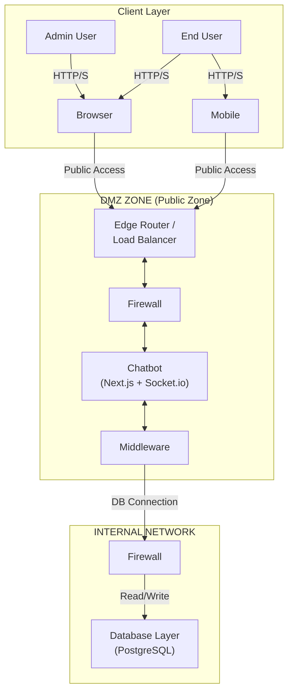
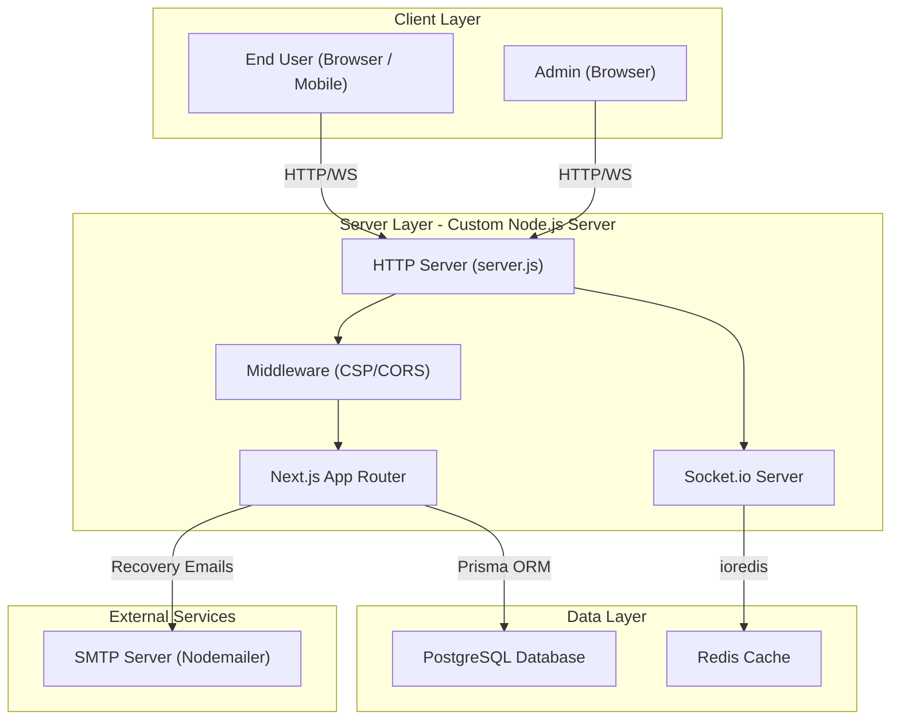
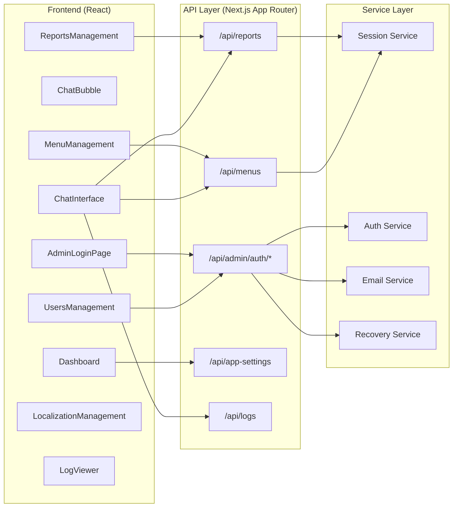
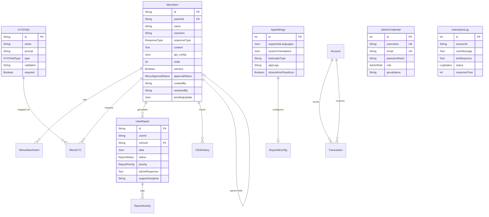
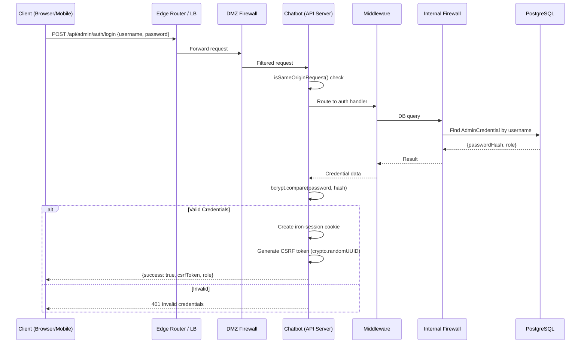
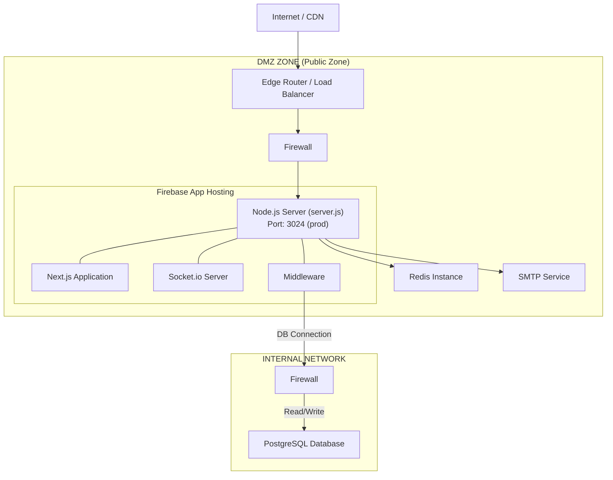
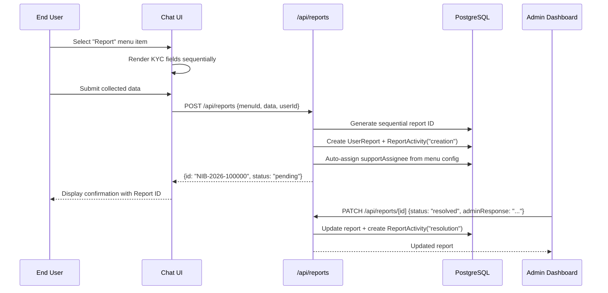
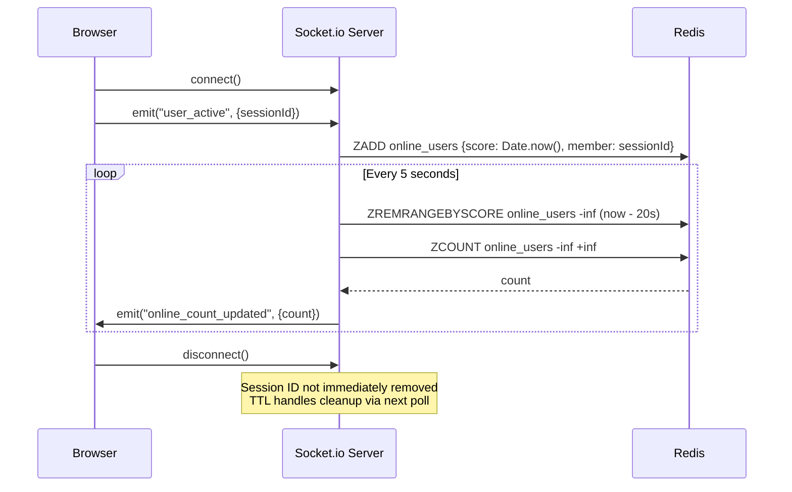

# System & Architecture Design Document (SDD)

**Project Name:** Nibbot — Conversational Bot Platform  
**Document Version:** 1.0  
**Classification:** Internal — Technical  
**Derived From:** Codebase Reverse-Engineering  

---

## Table of Contents

1. [Architecture Overview](#1-architecture-overview)
2. [System Components](#2-system-components)
3. [Architecture Diagrams](#3-architecture-diagrams)
4. [Data Flow](#4-data-flow)
5. [Technology Stack](#5-technology-stack)
6. [Database Architecture](#6-database-architecture)
7. [API Architecture](#7-api-architecture)
8. [Security Architecture](#8-security-architecture)
9. [Integration Architecture](#9-integration-architecture)
10. [Deployment Architecture](#10-deployment-architecture)
11. [Technical Constraints](#11-technical-constraints)
12. [Sequence Flows](#12-sequence-flows)
13. [Design Decisions](#13-design-decisions)

---

## 1. Architecture Overview

Nibbot is a full-stack, real-time conversational bot platform built on a **monolithic architecture** with an integrated WebSocket layer. The system serves two primary audiences: **end-users** who interact with a dynamic chat interface (via browser or mobile device), and **administrators** who configure conversational workflows, manage support tickets, and monitor system health.

The application is built as a **Next.js App Router** application running atop a **custom Node.js HTTP server** (`server.js`). This custom server wraps the Next.js request handler while simultaneously hosting a **Socket.io** server on the same port, enabling real-time presence tracking without a separate service.

The production deployment follows a **zone-based network architecture**: a **DMZ (Public Zone)** hosts the application behind an **Edge Router / Load Balancer** and a **Firewall**, while the **Database Layer** resides in a separate **Internal Network** protected by its own firewall. This separation ensures that the database is never directly exposed to public traffic.

**Core Architectural Principles (Observed in Code):**

- **Monolithic with Layered Separation:** All API routes, UI pages, and real-time logic reside in a single deployable unit, but are logically separated into `src/app/api/` (backend), `src/components/` (frontend), and `src/lib/` (shared utilities).
- **Maker-Checker Workflow:** Menu modifications by `admin` users require approval by `checker` users before going live — a dual-control governance pattern.
- **Graceful Degradation:** The Redis-backed presence system fails silently, allowing core HTTP functionality to remain operational.
- **Security-First:** Every mutating endpoint enforces session validation, CSRF token verification, and same-origin checks.
- **Defense in Depth:** Network-level firewalls in both the DMZ and Internal Network zones complement application-level security controls.

---

## 2. System Components

### 2.1 Custom HTTP/WebSocket Server (`server.js`)

| Attribute | Detail |
|:---|:---|
| **Runtime** | Node.js with `http.createServer` |
| **Frameworks** | Next.js (SSR/API), Socket.io (WebSocket) |
| **Port** | `9002` (dev) / `3024` (production), configurable via `PORT` env |
| **Responsibilities** | Request routing, CSP header injection, CORS handling, payload size enforcement (1MB), security headers, real-time presence broadcasting |

### 2.2 Next.js Application Layer

| Attribute | Detail |
|:---|:---|
| **Router** | App Router (`src/app/`) |
| **Pages** | `/` (Chat UI), `/admin` (Dashboard), `/admin/reset` (Password Reset) |
| **API Routes** | 10 route groups under `src/app/api/` |
| **Middleware** | `middleware.ts` — CSP nonce generation, CORS preflight, cache-control |

### 2.3 Frontend Components

| Module | File | Purpose |
|:---|:---|:---|
| Chat Interface | `ChatInterface.tsx` | End-user conversational UI with dynamic KYC input rendering |
| Chat Bubble | `ChatBubble.tsx` | Individual message rendering (bot/user) |
| Admin Login | `AdminLoginPage.tsx` | Credential-based admin authentication |
| Dashboard | `Dashboard.tsx` | System overview with real-time metrics |
| Menu Management | `MenuManagement.tsx` | Hierarchical menu CRUD with API config mapping |
| Reports Management | `ReportsManagement.tsx` | Ticket lifecycle management, rating/feedback review, support quality evaluation |
| Users Management | `UsersManagement.tsx` | Admin user CRUD (roles: admin, checker, support) |
| Localization | `LocalizationManagement.tsx` | Multi-language system translations |
| Log Viewer | `LogViewer.tsx` | Interaction log inspection |
| WYSIWYG Editor | `WysiwygEditor.tsx` | Rich-text content editor (TipTap-based) |

### 2.4 Shared Utilities (`src/lib/`)

| Module | Purpose |
|:---|:---|
| `session.ts` | Iron-session management, CSRF token rotation, same-origin validation |
| `auth.ts` | Bcrypt password hashing (10 salt rounds) |
| `prisma.ts` | Singleton Prisma client instance |
| `email.ts` | Nodemailer SMTP integration with Ethereal dev fallback |
| `adminRecovery.ts` | Database-backed password recovery tokens with TTL cleanup |
| `logger.ts` | Client-side interaction logging with sensitive data masking |
| `id-generator.ts` | Configurable sequential report ID generation |
| `store.ts` | Client-side state management |

---

## 3. Architecture Diagrams

### 3.1 Network Deployment Architecture (SAD)

The following diagram reflects the production network topology as defined in the System Architecture Diagram (SAD):



### 3.2 Application-Level System Architecture

The following diagram shows the internal application component relationships:



### 3.3 Component Architecture



---

## 4. Data Flow

### 4.1 User Chat Interaction Flow

1. **Client** loads the chat UI and fetches active, approved menus via `GET /api/menus`.
2. User selects a menu item; if `responseType` is:
   - **`static`**: Content is rendered directly from `content` / `contentAm` fields.
   - **`api`**: KYC fields are presented sequentially. Upon completion, the system constructs an API call using `apiConfig.endpoint` with template variable substitution (e.g., `{{kyc.accountId}}`), executes the call, and renders the JSON response as a table using `tableMappingMode` rules.
   - **`report`**: KYC fields are collected and submitted as a `UserReport` via `POST /api/reports`.
3. Each interaction is logged via `POST /api/logs` with sensitive data masked.

### 4.2 Menu Approval Flow (Maker-Checker)

1. **Admin** creates or updates a menu → status set to `pending` / stored as `pendingUpdate`.
2. **Checker** reviews via `POST /api/menus/[id]` with action `approve` or `reject`.
3. System enforces: **maker cannot approve their own menu** (self-approval blocked).
4. On approval, `pendingUpdate` fields are merged into the live menu record.
5. On rejection, `rejectionReason` is recorded and the pending state is preserved.

### 4.3 Feedback & Performance Evaluation Flow

1. Once a `UserReport` is resolved by support staff, the end user may submit a post-resolution rating and optional text feedback via `POST /api/reports/[id]`.
2. The client chat UI displays localized rating prompts, feedback placeholders, and confirmation text using translation keys such as `ui_rate_service`, `ui_rating_label`, `ui_rating_comment_prompt`, and `ui_rating_thanks`.
3. The rating endpoint validates a 1–5 integer score, prevents duplicate ratings, and stores:
   - `serviceRating`
   - `serviceFeedback`
   - `serviceRatedAt`
   - `serviceRatedBySessionId`
   - `serviceRatedSupportAssignee`
4. Admin-facing reports and activity streams expose user feedback and star ratings so support quality can be measured per report and per assignee.
5. This creates a performance evaluation mechanism based on real user experience rather than only internal status updates.

---

## 5. Technology Stack

| Layer | Technology | Version | Purpose |
|:---|:---|:---|:---|
| **Runtime** | Node.js | ≥18 | Server execution environment |
| **Framework** | Next.js | 16.2.1-canary | SSR, API Routes, App Router |
| **UI Library** | React | 19.2.1 | Component rendering |
| **Language** | TypeScript | 5.x | Type-safe development |
| **ORM** | Prisma | 7.5.0 | Database abstraction and migrations |
| **Database** | PostgreSQL | — | Primary relational data store |
| **Cache** | Redis (ioredis) | 5.10.1 | Real-time presence tracking |
| **WebSocket** | Socket.io | 4.8.3 | Bidirectional real-time communication |
| **Auth** | iron-session | 8.0.4 | Encrypted HTTP-only session cookies |
| **Hashing** | bcrypt | 6.0.0 | Password hashing (10 salt rounds) |
| **Email** | Nodemailer | 6.9.4 | SMTP transactional emails |
| **Styling** | Tailwind CSS | 3.4.1 | Utility-first CSS framework |
| **UI Components** | Radix UI | Various | Accessible headless components |
| **Rich Text** | TipTap | 2.11.5 | WYSIWYG editor for menu content |
| **Charts** | Recharts | 2.15.1 | Dashboard data visualization |
| **Validation** | Zod | 3.24.2 | Schema validation |
| **AI (Optional)** | Genkit + Google GenAI | 1.28.0 | AI flow scaffolding (present in deps) |

---

## 6. Database Architecture

### 6.1 Entity Relationship Diagram



### 6.2 Key Constraints

| Constraint | Table | Detail |
|:---|:---|:---|
| Self-referencing FK | `menu_items` | `parentId` → `menu_items.id` (CASCADE delete) |
| Unique composite | `menu_attachments` | `[menuId, attachedMenuId]` |
| Unique composite | `menu_kyc` | `[menuId, kycId]` |
| Unique | `admin_credentials` | `username`, `email` (independently unique) |
| Singleton pattern | `app_settings` | `id` defaults to `1` |

---

## 7. API Architecture

### 7.1 API Convention

All APIs follow a consistent JSON envelope pattern:

```json
{
  "status": "success" | "error",
  "message": "...",
  "data": { }
}
```

State-mutating responses include an `x-csrf-token` response header with a rotated token.

### 7.2 Complete API Inventory

| Route | Methods | Auth | RBAC | Purpose |
|:---|:---|:---|:---|:---|
| `/api/menus` | GET, POST | Session (POST) | admin (POST) | List/create menus |
| `/api/menus/[id]` | POST, PUT, DELETE | Session | checker (POST), admin (PUT/DEL) | Approve/reject, update, delete |
| `/api/menus/[id]/click` | POST | Origin check | Public | Click tracking |
| `/api/reports` | GET, POST | Session (GET) | admin/support (GET), public (POST) | List/create reports |
| `/api/reports/[id]` | GET, PATCH, DELETE | Session | admin/support | View, update, delete reports |
| `/api/reports/activities` | GET | Session | admin/support | Report activity log |
| `/api/admin/auth/login` | POST | Origin check | Public | Authenticate admin |
| `/api/admin/auth/logout` | POST | Session + CSRF | Authenticated | Destroy session |
| `/api/admin/auth/session` | GET | Session | Authenticated | Validate current session |
| `/api/admin/auth/forgot` | POST | Origin check | Public | Initiate password recovery |
| `/api/admin/auth/reset` | POST | Token-based | Public | Reset password via token |
| `/api/admin/auth/change-password` | POST | Session + CSRF | Authenticated | Change own password |
| `/api/admin/users` | GET, POST, PATCH, DELETE | Session + CSRF | admin | Full admin user CRUD |
| `/api/app-settings` | GET, PUT | Session + CSRF (PUT) | admin (PUT) | Global configuration |
| `/api/logs` | GET, POST | Session (GET) | admin (GET), public (POST) | Interaction logs |

---

## 8. Security Architecture

### 8.1 Authentication Flow



### 8.2 Security Mechanisms Summary

| Mechanism | Implementation | Source File |
|:---|:---|:---|
| **Password Hashing** | bcrypt, 10 salt rounds | `src/lib/auth.ts` |
| **Session Management** | iron-session, HTTP-only, Secure, SameSite cookie | `src/lib/session.ts` |
| **Session Idle Timeout** | Configurable via `ADMIN_SESSION_IDLE_MINUTES` (default: 15) | `src/lib/session.ts` |
| **CSRF Protection** | `x-csrf-token` header validated + rotated on every mutation | `src/lib/session.ts` |
| **Same-Origin Validation** | Origin/Referer/X-Forwarded-Host cross-check | `src/lib/session.ts` |
| **CSP Headers** | Dynamic nonce-based policy per request | `middleware.ts`, `server.js` |
| **Security Headers** | X-Frame-Options: DENY, HSTS, COEP, COOP, CORP | `server.js`, `next.config.ts` |
| **Payload Limits** | 1MB max request body (configurable via `MAX_REQUEST_BODY_BYTES`) | `server.js` |
| **Content-Type Enforcement** | Only `application/json`, form-urlencoded, multipart allowed on API routes | `server.js` |
| **Sensitive Data Masking** | Passwords, tokens, PINs masked in interaction logs | `src/lib/logger.ts`, `src/app/api/logs/route.ts` |
| **Password Recovery Tokens** | Database-persisted, TTL-based (1 hour), single-use, periodic cleanup | `src/lib/adminRecovery.ts` |
| **Password Strength** | Min 8 chars, uppercase, lowercase, digit, special character | `src/app/api/admin/users/route.ts` |
| **Self-Deletion Guard** | Cannot delete own admin account; cannot delete last admin | `src/app/api/admin/users/route.ts` |
| **Maker-Checker** | Admin cannot approve their own menu creation | `src/app/api/menus/[id]/route.ts` |
| **DMZ Firewall** | Filters inbound traffic from Edge Router before reaching application servers | Network infrastructure |
| **Internal Network Firewall** | Isolates database layer; only allows DB connections from the application middleware | Network infrastructure |
| **Edge Router / Load Balancer** | Terminates public HTTP/S connections and distributes traffic to application instances | Network infrastructure |

---

## 9. Integration Architecture

### 9.1 Internal Integrations

| From | To | Protocol | Purpose |
|:---|:---|:---|:---|
| Chat UI | Socket.io Server | WebSocket | Real-time presence heartbeat (`user_active`) |
| Socket.io Server | Redis | TCP (ioredis) | Sorted-set based presence tracking |
| API Routes | PostgreSQL | TCP (Prisma) | All persistent data operations |
| Admin Recovery | SMTP Server | SMTP (Nodemailer) | Password reset emails |

### 9.2 External Integrations

| Integration | Status | Evidence |
|:---|:---|:---|
| Firebase App Hosting | Configured | `apphosting.yaml` (maxInstances: 1) |
| Google GenAI (Genkit) | Dependency present | `package.json`, `src/ai/` directory exists |
| Third-party REST APIs | Dynamic via `apiConfig` | Menu items can proxy to arbitrary endpoints configured by admins |
| External OAuth/SSO | Not explicitly identified in implementation | — |

---

## 10. Deployment Architecture

### 10.1 Deployment Diagram



### 10.2 Environment Configuration

| Variable | Purpose | Default |
|:---|:---|:---|
| `PORT` | Server listen port | `9002` (dev) / `3024` (prod) |
| `DATABASE_URL` | PostgreSQL connection string | Required |
| `REDIS_URL` | Redis connection string | Optional |
| `SECRET_COOKIE_PASSWORD` | iron-session encryption key | Required |
| `ADMIN_SESSION_IDLE_MINUTES` | Session timeout | `15` |
| `SMTP_HOST` / `SMTP_PORT` / `SMTP_USER` / `SMTP_PASS` | Email delivery | Optional (Ethereal fallback in dev) |
| `ADMIN_INITIAL_USERNAME` / `ADMIN_INITIAL_PASSWORD` | Bootstrap admin account | `admin` / `Admin@1234` (localhost only) |
| `NEXT_PUBLIC_SITE_URL` | Public-facing URL | — |
| `APP_ORIGIN` | Allowed origin for CORS/CSP | `http://localhost:9002` |
| `ALLOWED_ORIGINS` | Comma-separated additional origins | — |
| `MAX_REQUEST_BODY_BYTES` | Max payload size | `1048576` (1MB) |

### 10.3 Startup Modes

| Command | Mode | Behavior |
|:---|:---|:---|
| `npm run dev` | Next.js Dev (Turbopack) | Standard Next.js dev server on port 9003 |
| `npm run dev:io` | Full Dev (Socket.io) | Custom server with WebSocket on port 9002 |
| `npm run start` | Production | Custom server on port 3020+ with all features |

---

## 11. Technical Constraints

| Constraint | Detail |
|:---|:---|
| **Single-Instance WebSocket** | Socket.io state is in-memory per instance; horizontal scaling requires Redis adapter (not yet configured) |
| **Singleton AppSettings** | `app_settings` table enforces a single row (id=1) |
| **JSON API Config** | Menu API configurations are stored as untyped JSON in PostgreSQL, validated at API layer only |
| **File Upload Storage** | Avatar/logo images are persisted to local filesystem (`public/uploads/`), not object storage |
| **Image Size Limit** | Avatar images capped at 600KB |
| **TypeScript Build Errors** | `ignoreBuildErrors: true` in `next.config.ts` — build proceeds despite type errors |
| **Redis Optional** | Presence tracking degrades gracefully but is unavailable without Redis |

---

## 12. Sequence Flows

### 12.1 Report Submission & Resolution Flow



### 12.2 Real-Time Presence Tracking



---

## 13. Design Decisions

| Decision | Rationale (Observed in Code) |
|:---|:---|
| **Custom HTTP server over Next.js standalone** | Required to co-locate Socket.io on the same port, avoiding separate WebSocket infrastructure |
| **iron-session over JWT** | Server-side encrypted session storage eliminates token revocation complexity; HTTP-only cookies prevent XSS token theft |
| **Maker-Checker for menus** | Governance control: prevents a single admin from deploying untested configurations to production users |
| **Redis Sorted Sets for presence** | Scores represent timestamps, enabling efficient range-based TTL cleanup (`ZREMRANGEBYSCORE`) without per-key TTL management |
| **Prisma JSON fields for apiConfig** | Allows flexible, schema-free API configuration per menu without requiring schema migrations for each new field |
| **Sensitive data masking in logs** | Proactive PII protection: passwords, tokens, PINs, CVVs are masked before database persistence |
| **Database-backed recovery tokens** | Production-safe alternative to in-memory token storage; supports multi-instance deployments with periodic cleanup |
| **Sequential Report IDs** | Human-readable, configurable format (prefix + year + sequence) preferred over UUIDs for customer-facing ticket references |
| **TipTap for rich content** | Enables non-technical admins to create formatted menu content (tables, links, images) without HTML knowledge |
| **Localizable rating and feedback UI** | Rating prompts, feedback placeholders and confirmation messages are translated via the global localization store for consistent multi-language support |
| **Feedback-driven performance evaluation** | Resolved reports collect user ratings and comments that are surfaced in admin report management for support quality measurement |

---

## Codebase Evidence Summary

| Source File | Insights Derived |
|:---|:---|
| `server.js` | Custom HTTP server, Socket.io integration, Redis presence, CSP, CORS, security headers |
| `middleware.ts` | Edge-layer CSP nonce generation, CORS preflight handling |
| `next.config.ts` | Security headers, image domains, build configuration |
| `prisma/schema.prisma` | Complete database schema (16 models, 6 enums) |
| `src/lib/session.ts` | iron-session config, CSRF rotation, same-origin validation, idle timeout |
| `src/lib/auth.ts` | bcrypt hashing configuration |
| `src/lib/email.ts` | Nodemailer SMTP with Ethereal dev fallback |
| `src/lib/adminRecovery.ts` | Database-persisted recovery tokens with TTL |
| `src/app/api/menus/route.ts` | Menu CRUD, API config normalization, endpoint template validation |
| `src/app/api/menus/[id]/route.ts` | Maker-checker approval workflow, pending update merge logic |
| `src/app/api/reports/route.ts` | Sequential ID generation, auto-assignment, activity logging |
| `src/app/api/reports/[id]/route.ts` | Report lifecycle, escalation, support assignment, rating submission validation |
| `src/lib/store.ts` | Localized UI translation store including rating and feedback prompts |
| `src/components/user/ChatInterface.tsx` | Rating interaction flow and feedback submission in the user chat UI |
| `src/app/api/admin/auth/login/route.ts` | Bootstrap admin seeding, authentication flow |
| `src/app/api/admin/users/route.ts` | User CRUD, password strength validation, self-deletion guard |
| `src/app/api/app-settings/route.ts` | Singleton settings, avatar image persistence, report ID config |
| `src/app/api/logs/route.ts` | Interaction logging with sensitive data masking |
| `package.json` | Complete dependency inventory, script definitions |
| `apphosting.yaml` | Firebase App Hosting deployment configuration |
