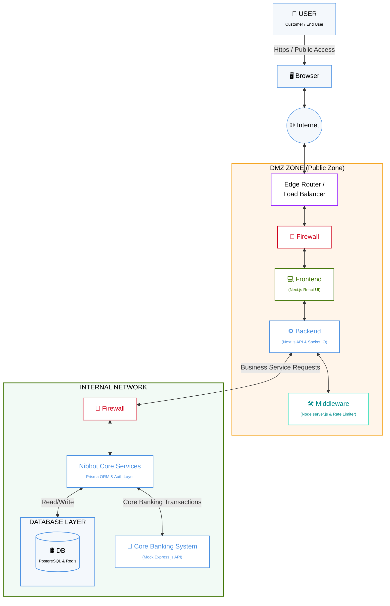

# Software Architecture Document (SAD)
## Nibbot Platform

---

### 1. Introduction

#### 1.1 Purpose
This document provides a comprehensive architectural overview of the Nibbot platform. It serves to communicate the system's structural design, deployment topology, and core technical decisions to stakeholders, software engineers, security auditors, and system administrators.

#### 1.2 Scope
The scope of this document covers the entire Nibbot chatbot ecosystem, including the customer-facing conversational interfaces, the administrative dashboard, real-time presence mechanisms, data persistence layers, and external integration points (such as AI models and Core Banking mock APIs).

---

### 2. Architectural Representation

The system architecture follows a tiered security model, strictly dividing public internet traffic from internal business logic and data persistence. 

Below is the standard representation of the architecture mapping the deployment topology and data flow:

---

### 3. Architectural Goals and Constraints

- **Security & Perimeter Defense:** The system mandates a strict separation between the DMZ and the Internal Network. Administrative endpoints must be protected by anti-spoofing IP mechanisms, rate limiting, and HTTP-only encrypted session cookies.
- **Real-Time Responsiveness:** The platform must support instantaneous live chat and presence tracking using full-duplex WebSockets.
- **Scalability:** Next.js API routes are designed statelessly to support horizontal scaling, utilizing Redis as the centralized state manager for sessions and rate locks.
- **Extensibility:** The system's integration layers (particularly the LLM integration) are abstracted, ensuring the capability to transition from external AI providers to internally hosted Retrieval-Augmented Generation (RAG) models seamlessly.

---

### 4. Logical View

The Logical View describes the functional components of the system across the two main network zones.

#### 4.1 DMZ (Public Zone) Components
- **Edge Router / Load Balancer:** The primary gateway for incoming internet traffic, responsible for SSL termination and traffic distribution.
- **Frontend (Next.js React UI):** Serves the Next.js Client Components (React 19). It renders both the anonymous customer-facing chat widget and the secure administrative dashboard.
- **Backend (Next.js App Router):** Handles Server-Side Rendering (SSR) and processes incoming REST API requests (`/api/*`).
- **Middleware (Custom Node `server.js`):** A wrapper executing alongside the Next.js instance. It enforces global rate limits, checks request payload limits, injects secure unforgeable client IP headers (`x-direct-client-ip`), and mounts the Socket.IO real-time engine.

#### 4.2 Internal Network Components
- **Nibbot Core Services:** The central business logic tier handling payload validation (via Zod), entity state management, identity verification, and object-relational mapping (Prisma ORM).
- **Database Layer:**
  - *PostgreSQL:* The primary relational persistent storage. Manages structural data such as User Reports, Chat Logs, Dynamic Menus, and encrypted Admin Credentials.
  - *Redis:* A high-performance in-memory datastore managing transient states like live user presence heartbeats, distributed rate-limit locks, and concurrent session tracking.
- **External / Mock Integrations:**
  - *Banking System Integration:* A localized Mock Banking API (Express.js) designed to simulate processing core financial transactions and exchange rate fetching securely.
  - *AI/LLM Services:* Authorized outbound connections to commercial LLMs for generative chat contextualization.

---

### 5. Process View / Data Flow

#### 5.1 Real-Time Chat & Presence Monitoring
1. A customer accesses the frontend application.
2. The Next.js custom server upgrades the connection from HTTP to WebSockets (via Socket.IO).
3. The user's presence heartbeat is periodically logged into the Redis cache using sorted sets (`zadd`).
4. Chat messages are routed through the Backend to the GenAI model, while the resulting interactions are asynchronously logged to PostgreSQL.

#### 5.2 Administrative Authentication Workflow
1. An administrator submits their credentials via the login interface.
2. The Node.js Middleware enforces strict, IP-based rate limiting to prevent credential stuffing and brute-forcing.
3. The Nibbot Core Services query PostgreSQL via Prisma, comparing the provided password against the `bcrypt` hash.
4. Upon successful validation, a strongly encrypted, HTTP-only `iron-session` cookie is issued, containing a CSRF token for subsequent requests.

---

### 6. Security Architecture

- **Proxy Trust Boundaries:** The Node.js custom server directly captures raw TCP socket IPs and forwards them down the stack via an internal header (`x-direct-client-ip`). This strictly prevents `X-Forwarded-For` header spoofing attacks.
- **Dependency Hardening:** External packages (such as `nodemailer` and `undici`) are pinned to hardened versions to prevent SSRF vulnerabilities and TLS verification bypasses.
- **Data Privacy & Storage:** Sensitive operations (such as managing report drafts and workflow metadata) are maintained entirely server-side. Browser `localStorage` is restricted exclusively to non-sensitive anonymous telemetry IDs that grant zero authentication privileges.
- **Malware Scanning:** File uploads are subjected to strict MIME type validation, Magic Byte signature verification, and anti-malware buffer scanning before being persisted to the internal network.

---

### 7. Technology Stack

| Category | Technologies |
| :--- | :--- |
| **Frontend / Web Client** | Next.js 16 (React 19), Tailwind CSS, Framer Motion, Radix UI |
| **Backend Framework** | Next.js App Router, Node.js 20+ |
| **Relational Database** | PostgreSQL 16+ |
| **ORM / Data Access** | Prisma 7.5.0 |
| **Caching & PubSub** | Redis (`ioredis`) |
| **Real-Time Communication** | WebSockets (Socket.IO) |
| **Security & Auth** | `bcrypt` (hashing), `iron-session` (stateless sessions), Zod |
