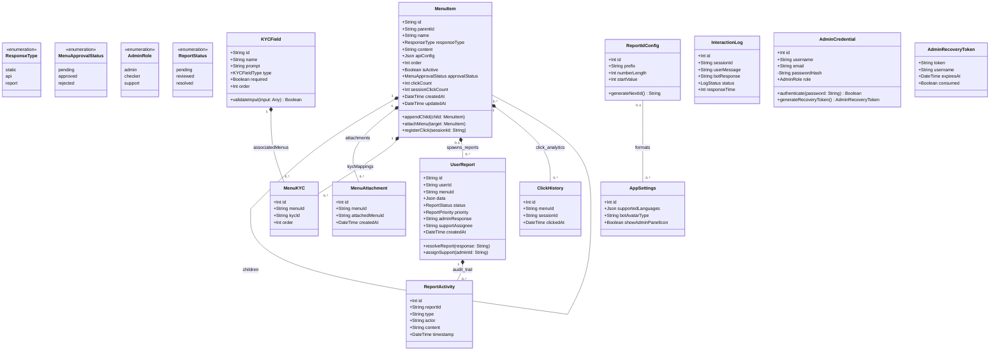

# Nibbot (TalkTree) UML Class Diagram Specification

This document provides a complete, accurate Low-Level Design (LLD) UML Class Diagram for the TalkTree system, directly derived from the core database schemas and system interactions.

## 1. Identified Classes, Attributes, and Methods

### `MenuItem`
Represents the core building block of the conversational flow and UI navigation.
*   **Attributes:**
    *   `+ id: String`
    *   `+ parentId: String?`
    *   `+ name: String`
    *   `+ nameAm: String?`
    *   `+ responseType: ResponseType` (static, api, report)
    *   `+ content: String?`
    *   `+ contentAm: String?`
    *   `+ apiConfig: Json?`
    *   `+ supportAssignee: String?`
    *   `+ order: Int`
    *   `+ isActive: Boolean`
    *   `+ approvalStatus: MenuApprovalStatus`
    *   `+ createdBy: String?`
    *   `+ reviewedBy: String?`
    *   `+ trackClicks: Boolean`
    *   `+ clickCount: Int`
    *   `+ sessionClickCount: Int`
    *   `+ createdAt: DateTime`
    *   `+ updatedAt: DateTime`
*   **Methods:**
    *   `+ appendChild(child: MenuItem): void`
    *   `+ attachMenu(target: MenuItem): void`
    *   `+ registerClick(sessionId: String): void`
    *   `+ updateApprovalStatus(status: MenuApprovalStatus): void`

### `MenuAttachment`
A junction class representing many-to-many explicit linkages between different menus.
*   **Attributes:**
    *   `+ id: Int`
    *   `+ menuId: String`
    *   `+ attachedMenuId: String`
    *   `+ createdAt: DateTime`

### `KYCField`
Represents dynamic data collection fields (e.g., asking for an account number).
*   **Attributes:**
    *   `+ id: String`
    *   `+ name: String`
    *   `+ prompt: String`
    *   `+ promptAm: String?`
    *   `+ type: KYCFieldType` (text, number, email, etc.)
    *   `+ validation: String?`
    *   `+ required: Boolean`
    *   `+ order: Int`
*   **Methods:**
    *   `+ validateInput(input: Any): Boolean`

### `MenuKYC`
A junction class binding KYC fields to specific menus.
*   **Attributes:**
    *   `+ id: Int`
    *   `+ menuId: String`
    *   `+ kycId: String`
    *   `+ order: Int`

### `UserReport`
Records a user's submitted report or form data via the chatbot.
*   **Attributes:**
    *   `+ id: String`
    *   `+ userId: String?`
    *   `+ menuId: String?`
    *   `+ menuName: String`
    *   `+ data: Json`
    *   `+ status: ReportStatus`
    *   `+ priority: ReportPriority`
    *   `+ adminResponse: String?`
    *   `+ supportAssignee: String?`
    *   `+ serviceRating: Int?`
    *   `+ serviceFeedback: String?`
    *   `+ createdAt: DateTime`
*   **Methods:**
    *   `+ resolveReport(response: String): void`
    *   `+ escalatePriority(newPriority: ReportPriority): void`
    *   `+ assignSupport(adminId: String): void`

### `ReportActivity`
Logs audit trails and timeline events for a given `UserReport`.
*   **Attributes:**
    *   `+ id: Int`
    *   `+ reportId: String`
    *   `+ type: String`
    *   `+ actor: String`
    *   `+ content: String?`
    *   `+ timestamp: DateTime`

### `AppSettings`
Singleton configuration for the whole application.
*   **Attributes:**
    *   `+ id: Int`
    *   `+ supportedLanguages: Json?`
    *   `+ systemTranslations: Json?`
    *   `+ botAvatarType: String`
    *   `+ botAvatarImage: String?`
    *   `+ appLogo: String?`
    *   `+ showAdminPanelIcon: Boolean`

### `ReportIdConfig`
Configuration determining how new Report IDs are sequentially generated.
*   **Attributes:**
    *   `+ id: Int`
    *   `+ prefix: String`
    *   `+ yearEnabled: Boolean`
    *   `+ numberLength: Int`
    *   `+ startValue: Int`
    *   `+ resetEveryYear: Boolean`
*   **Methods:**
    *   `+ generateNextId(): String`

### `ClickHistory`
Audit table mapping individual user sessions to menu clicks for analytics.
*   **Attributes:**
    *   `+ id: Int`
    *   `+ menuId: String`
    *   `+ sessionId: String`
    *   `+ clickedAt: DateTime`

### `InteractionLog`
Logs raw dialogue/interaction between the user and the bot.
*   **Attributes:**
    *   `+ id: Int`
    *   `+ sessionId: String`
    *   `+ userMessage: String`
    *   `+ botResponse: String`
    *   `+ status: LogStatus`
    *   `+ endpoint: String?`
    *   `+ responseTime: Int?`
    *   `+ timestamp: DateTime`

### `AdminCredential`
Identity and Access configuration for system administrators.
*   **Attributes:**
    *   `+ id: Int`
    *   `+ username: String`
    *   `+ email: String`
    *   `- passwordHash: String`
    *   `+ role: AdminRole`
    *   `+ groupName: String?`
*   **Methods:**
    *   `+ authenticate(password: String): Boolean`
    *   `+ generateRecoveryToken(): AdminRecoveryToken`

### `AdminRecoveryToken`
Token issuance for password recovery operations.
*   **Attributes:**
    *   `+ token: String`
    *   `+ username: String`
    *   `+ expiresAt: DateTime`
    *   `+ consumed: Boolean`

---

## 2. Relationships and Multiplicity

1.  **MenuItem to MenuItem (Parent/Child)**
    *   **Relationship:** Composition (Hierarchy)
    *   **Multiplicity:** `1` (Parent) has `0..*` (Children). Deleting the parent cascades to children.
2.  **MenuItem to MenuAttachment**
    *   **Relationship:** Composition
    *   **Multiplicity:** `1` (MenuItem) has `0..*` (MenuAttachments). A junction table managing many-to-many menu linkages.
3.  **MenuItem to MenuKYC**
    *   **Relationship:** Composition
    *   **Multiplicity:** `1` (MenuItem) has `0..*` (MenuKYC configurations).
4.  **KYCField to MenuKYC**
    *   **Relationship:** Composition
    *   **Multiplicity:** `1` (KYCField) has `0..*` (MenuKYC configurations). A single KYC field can be used in multiple menus.
5.  **MenuItem to UserReport**
    *   **Relationship:** Composition
    *   **Multiplicity:** `0..1` (MenuItem) has `0..*` (UserReports). A form submission (report) is spawned by a specific menu.
6.  **UserReport to ReportActivity**
    *   **Relationship:** Composition
    *   **Multiplicity:** `1` (UserReport) has `0..*` (ReportActivities).
7.  **MenuItem to ClickHistory**
    *   **Relationship:** Composition
    *   **Multiplicity:** `1` (MenuItem) has `0..*` (ClickHistories).
8.  **ReportIdConfig to AppSettings**
    *   **Relationship:** Association
    *   **Multiplicity:** `0..1` (ReportIdConfig) formats `0..*` (AppSettings).

---

## 3. Mermaid UML Structure

